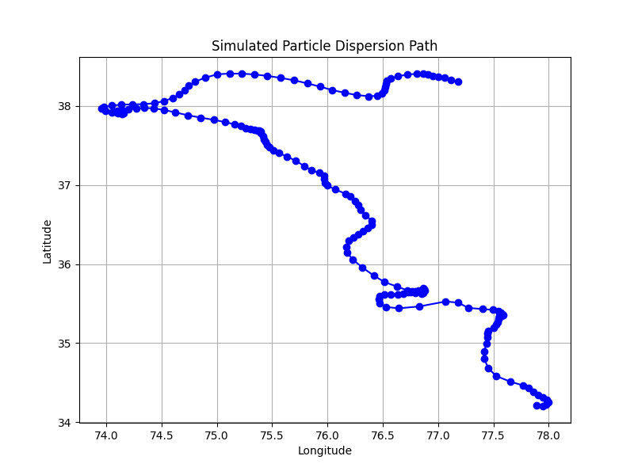

# EcoFlight

EcoFlight is a simulation tool designed to model the dispersion of wind-carried materials—such as pollutants, spores, seeds, or microplastics—using wind vector data. This project was built with the intention of combining environmental science and software engineering to better understand and visualize how atmospheric dynamics influence ecological impact.

---

## Purpose

Understanding how materials move through the atmosphere is essential to environmental modeling, disaster response, and urban planning. EcoFlight simulates this movement using wind speed and direction over time to estimate potential spread paths. The project aims to offer a foundation for more advanced modeling efforts while demonstrating the power of accessible, open-source tools in environmental research.

---

## Key Features

- Generates simulated or real wind data for any coordinate input
- Simulates particle drift based on wind speed and directional vectors
- Visualizes spread paths using geographic plotting
- Modular structure for expansion into real-world environmental applications

---

## How It Works

1. The user provides a starting location (latitude and longitude).
2. The system either generates mock wind data or can be connected to real APIs for historical wind vectors.
3. Each wind vector is used to incrementally shift the location over time using simple trigonometric calculations.
4. The path is visualized on a static 2D map, showing the direction and distance of potential dispersion.

---

## Example Output

Output is saved to the `outputs/` directory. Below is an example simulation path plot:

---

## Project Structure

ecoflight/
├── data/ # Wind data (mock or real)
├── outputs/ # Generated maps/plots
├── main.py # Project entry point
├── wind_fetcher.py # Wind data generator
├── simulator.py # Wind-based material spread simulation
├── visualizer.py # Path plotting tool
├── utils.py # Optional helpers for formatting and math
├── requirements.txt # Python dependencies
└── README.md